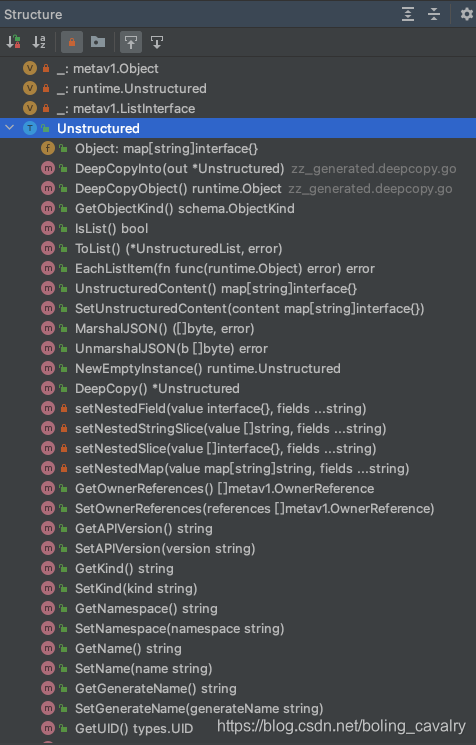

# pod-state-mysql


# Day1 

 kubectl 多配置集群管理


```
export KUBECONFIG=~/.kube/config:~/.kube/kubconfig2
kubectl config view --flatten > ~/.kube/merged_kubeconfig
```


不太好用，还是手动修改吧。

```
#一个访问凭证时#
apiVersion: v1
clusters:
- cluster:
    certificate-authority-data: ***
    server: https://192.168.*.*:6443
  name: kubernetes
contexts:
- context:
    cluster: kubernetes
    user: kubernetes-admin
  name: kubernetes-admin@kubernetes
current-context: kubernetes-admin@kubernetes
kind: Config
preferences: {}
users:
- name: kubernetes-admin
  user:
    client-certificate-data: ***
    client-key-data: ***


#两个访问凭证时#
apiVersion: v1
clusters:
- cluster:
    certificate-authority-data: ***
    server: https://42.194.*.*:443/
  name: cls-ec6ymsmo
- cluster:
    certificate-authority-data: ***
    server: https://192.168.*.*:6443
  name: kubernetes
contexts:
- context:
    cluster: cls-ec6ymsmo
    user: "10000******"
  name: cls-ec6ymsmo-10000******
- context:
    cluster: kubernetes
    user: kubernetes-admin
  name: kubernetes-admin@kubernetes
current-context: kubernetes-admin@kubernetes
kind: Config
preferences: {}
users:
- name: "100006621061"
  user:
    client-certificate-data: ***
    client-key-data: ***
- name: kubernetes-admin
  user:
    client-certificate-data: ***
    client-key-data: ***
    
```

主要就是不重名就行，context和user和cluster的名字分别不一致就可以。


```
kubectl config get-contexts
CURRENT   NAME                           CLUSTER       AUTHINFO            NAMESPACE
*         kubernetes-admin@kubernetes    kubernetes    kubernetes-admin
          kubernetes-admin@kubernetes2   kubernetes2   kubernetes-admin2
```

```
kubectl config use-context kubernetes-admin@kubernetes2
Switched to context "kubernetes-admin@kubernetes2"

```

```
kubectl config get-contexts
CURRENT   NAME                           CLUSTER       AUTHINFO            NAMESPACE
          kubernetes-admin@kubernetes    kubernetes    kubernetes-admin
*         kubernetes-admin@kubernetes2   kubernetes2   kubernetes-admin2
```

# day2
client-go动态客户端
参考文章：https://blog.csdn.net/boling_cavalry/article/details/113795523?ops_request_misc=%257B%2522request%255Fid%2522%253A%2522171682172916800226542286%2522%252C%2522scm%2522%253A%252220140713.130102334.pc%255Fblog.%2522%257D&request_id=171682172916800226542286&biz_id=0&utm_medium=distribute.pc_search_result.none-task-blog-2~blog~first_rank_ecpm_v1~rank_v31_ecpm-3-113795523-null-null.nonecase&utm_term=clientgo&spm=1018.2226.3001.4450


dynamicClient

为什么要用到dynamicClient而不用clientset,因为CRD，clientset只能访问pod,deployment内置资源,不过也比较够用


Object.runtime
聊Object.runtime之前先要明确两个概念：资源和资源对象，关于资源大家都很熟悉了，pod、deployment这些不都是资源嘛，个人的理解是资源更像一个严格的定义，当您在kubernetes中创建了一个deployment之后，这个新建的deployment实例就是资源对象了；
在kubernetes的代码世界中，资源对象对应着具体的数据结构，这些数据结构都实现了同一个接口，名为Object.runtime，源码位置是staging/src/k8s.io/apimachinery/pkg/runtime/interfaces.go，定义如下：

``` 
type Object interface {
	GetObjectKind() schema.ObjectKind
	DeepCopyObject() Object
}
```
DeepCopyObject方法顾名思义，就是深拷贝，也就是将内存中的对象克隆出一个新的对象；
至于GetObjectKind方法的作用，相信聪明的您也猜到了：处理Object.runtime类型的变量时，只要调用其GetObjectKind方法就知道它的具体身份了（如deployment，service等）；
最后再次强调：资源对象都是Object.runtime的实现；

Unstructured
在聊Unstructured之前，先看一个简单的JSON字符串：
{
"id": 101,
"name": "Tom"
}

上述JSON的字段名称和字段值类型都是固定的，因此可以针对性编写一个数据结构来处理它：
```azure
type Person struct {
	ID int
	Name String
}

```
对于上面的JSON字符串就是结构化数据（Structured Data），这个应该好理解；
与结构化数据相对的就是非结构化数据了（Unstructured Data），在实际的kubernetes环境中，可能会遇到一些无法预知结构的数据，例如前面的JSON字符串中还有第三个字段，字段值的具体内容和类型在编码时并不知晓，而是在真正运行的时候才知道，那么在编码时如何处理呢？相信您会想到用interface{}来表示，实际上client-go也是这么做的，来看Unstructured数据结构的源码，路径是staging/src/k8s.io/apimachinery/pkg/apis/meta/v1/unstructured/unstructured.go：
```azure
type Unstructured struct {
	// Object is a JSON compatible map with string, float, int, bool, []interface{}, or
	// map[string]interface{}
	// children.
	Object map[string]interface{}
}
```
显然，上述数据结构定义并不能发挥什么作用，真正重要的是关联的方法，如下图，可见client-go已经为Unstructured准备了丰富的方法，借助这些方法可以灵活的处理非结构化数据：



# day3 informer

https://blog.csdn.net/WangDong_CNDS/article/details/108417472?ops_request_misc=%257B%2522request%255Fid%2522%253A%2522171693184616800225597082%2522%252C%2522scm%2522%253A%252220140713.130102334.pc%255Fcommercial.%2522%257D&request_id=171693184616800225597082&biz_id=0&utm_medium=distribute.pc_search_result.none-task-blog-2~all~insert_commercial~default-3-108417472-null-null.142^v100^pc_search_result_base7&utm_term=informer&spm=1018.2226.3001.4187
SharedInformerFactory，Shared指的是在多个Informer/lister共享一个本地cache, 资源的变化会同时通知到cache和 listers
如main.go所示
就是通过informer.AddEventHandler增加自己的回调函数，通过onadd,onupdate,ondelete函数触发mysql持久化操作
例子中初始化个nodeinformer,也可以初始化podinformer

通过podinformer onadd的调用，mysql insert数据


# day4 AddEventHander对podinformer进行监听，监听的数据通过钉钉发出
通过dockerfile 

```
FROM golang:1.22-alpine
ENV GO111MODULE=on
WORKDIR /app
COPY go.mod .
COPY go.sum .
RUN go mod download
RUN go build main -o main.go
COPY . .
RUN CGO_ENABLED=0 GOOS=linux GOARCH=amd64 go build
ENV HTTP_PORT=8080
EXPOSE 8080
ENTRYPOINT ["/app/main"]
```
通过多阶段精简一下体积
```
# BUILD
FROM golang:1.22-alpine as BUILD
ENV GO111MODULE=on
WORKDIR /app
COPY go.mod .
COPY go.sum .
RUN go mod download
RUN go build main -o main.go
COPY . .
RUN CGO_ENABLED=0 GOOS=linux GOARCH=amd64 go build
ENV HTTP_PORT=8080
EXPOSE 8080
# BINARIES
FROM alpine:latest
COPY --from=BUILD /app/main /app/maini
ENTRYPOINT ["/app/main"]
```

再换一个更小的镜像
# BUILD
FROM golang:1.22-alpine as BUILD
ENV GO111MODULE=on
WORKDIR /app
COPY go.mod .
COPY go.sum .
RUN go mod download
RUN go build main.go -o main
COPY . .
RUN CGO_ENABLED=0 GOOS=linux GOARCH=amd64 go build
ENV HTTP_PORT=8080
EXPOSE 8080
# MINIATURE
FROM scratch
# 这个证书对我来说没有必要
# COPY --from=BUILD /etc/ssl/certs/ca-certificates.crt /etc/ssl/certs/
COPY --from=BUILD /app/main /app/main
ENTRYPOINT ["/app/main"]
